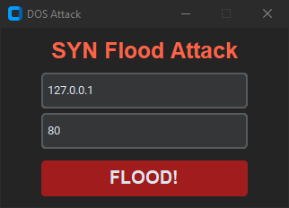

# SYN-Flooding

A simple Python project to demonstrate a SYN Flooding attack for educational and testing purposes.

- Repeatedly sends SYN packets to a target to simulate a DoS attack
- Customizable target IP, port

## Disclaimer ‼️

This project is for educational purposes only. Do not use it to attack systems without explicit permission.